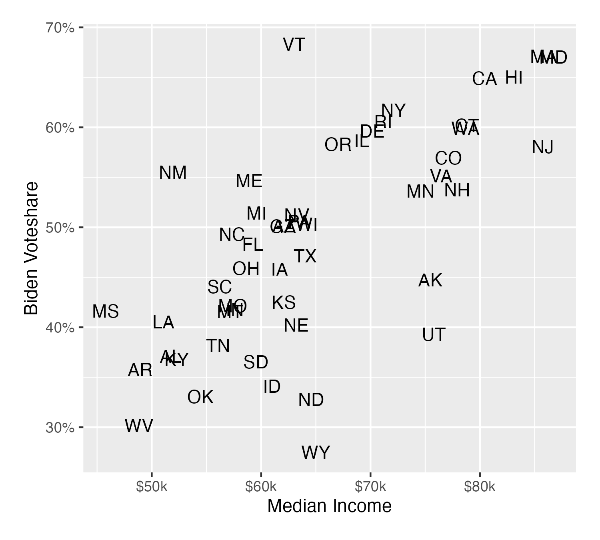
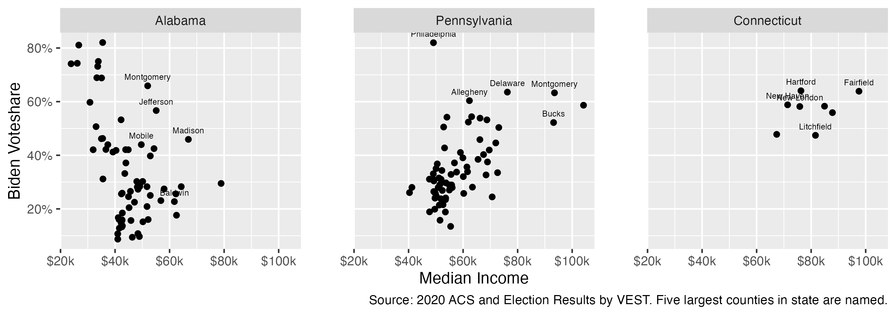

# substate-income-vote

<!-- badges: start -->
<!-- badges: end -->

A short example showing the correlation between income and vote at the sub-state level. A partial update to Gelman et al.'s "Rich State, Poor State, Red State, Blue State, What's the Matter with Connecticut". (2007)

**State-Level Correlation**

{width=50%}

**County-Level Correlation**

## Data

- `counties.csv` is made in `01_get_income.R` and is a combination of ACS, VEST, and ALARM data
- `states.csv` is made separately and values are taken from Wikipedia.

## Further Reading

- Gelman, Andrew, et al. "Rich State, Poor State, Red State, Blue State: What’s the Matter with Connecticut?." _Quarterly Journal of Political Science_ 2 (2007): 345-36  
- Zacher, Sam. "Polarization of the Rich: The New Democratic Allegiance of Affluent Americans and the Politics of Redistribution." _Perspectives on Politics_ (2023): 1-19.
